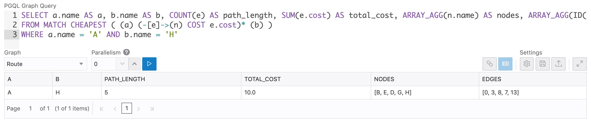
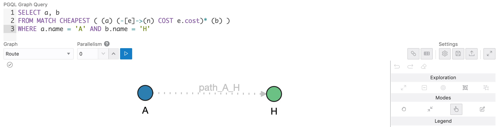
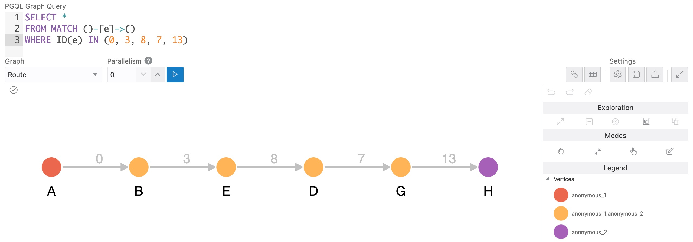

# shortest-path

Try graph queries in 5 min.

## Setup

Install JDK 11 on your Linux.

Download [Oracle Graph Server](https://www.oracle.com/database/technologies/spatialandgraph/property-graph-features/graph-server-and-client/graph-server-and-client-downloads.html).

Install Oracle Graph Server.

## Try graph queries

Locate graph dataset files.

    /<path_to_the_files>/route.csv
    /<path_to_the_files>/route.json

Open JShell.

    cd /opt/oracle/graph/bin
    ./opg-jshell

    var graph = session.readGraphWithProperties("/<path_to_the_files>/route.json");

Run a shortest path query.

[`shortest-path.pgql`](./pgql/shortest-path.pgql)

    graph.queryPgql(
      " SELECT a.name AS a, b.name AS b, COUNT(e) AS path_length, SUM(e.cost) AS total_cost, ARRAY_AGG(n.name) AS nodes "
    + " FROM MATCH TOP 3 SHORTEST ( (a) (-[e]->(n))* (b) ) "
    + " WHERE a.name = 'A' AND b.name = 'H' "
    ).print();

    +-------------------------------------------------+
    | a | b | path_length | total_cost | nodes        |
    +-------------------------------------------------+
    | A | H | 3           | 12.0       | [B, E, H]    |
    | A | H | 3           | 11.0       | [D, G, H]    |
    | A | H | 4           | 15.0       | [B, C, E, H] |
    +-------------------------------------------------+

Run a cheapest path query.

[`cheapest-path.pgql`](./pgql/cheapest-path.pgql)

    graph.queryPgql(
      " SELECT a.name AS a, b.name AS b, COUNT(e) AS path_length, SUM(e.cost) AS total_cost, ARRAY_AGG(n.name) AS nodes "
    + " FROM MATCH TOP 3 CHEAPEST ( (a) (-[e]->(n) COST e.cost)* (b) ) "
    + " WHERE a.name = 'A' AND b.name = 'H' "
    ).print();

    +----------------------------------------------------+
    | a | b | path_length | total_cost | nodes           |
    +----------------------------------------------------+
    | A | H | 5           | 10.0       | [B, E, D, G, H] |
    | A | H | 3           | 11.0       | [D, G, H]       |
    | A | H | 3           | 12.0       | [B, E, H]       |
    +----------------------------------------------------+

Exit JShell.

    /exit

## Using Graph Viz

Graph Viz can also return the result as a table.

    SELECT a.name AS a, b.name AS b, COUNT(e) AS path_length, SUM(e.cost) AS total_cost, ARRAY_AGG(n.name) AS nodes, ARRAY_AGG(ID(e)) AS edges
    FROM MATCH CHEAPEST ( (a) (-[e]->(n) COST e.cost)* (b) )
    WHERE a.name = 'A' AND b.name = 'H'

However, the path detected is visualized as a dot-line only.

    SELECT a, b
    FROM MATCH CHEAPEST ( (a) (-[e]->(n) COST e.cost)* (b) )
    WHERE a.name = 'A' AND b.name = 'H'

To show the intermediate nodes, visualize the list of edges.

    SELECT *
    FROM MATCH ()-[e]->()
    WHERE ID(e) IN (0, 3, 8, 7, 13)

## Using Algorithm API

src = graph.getVertex(128);

